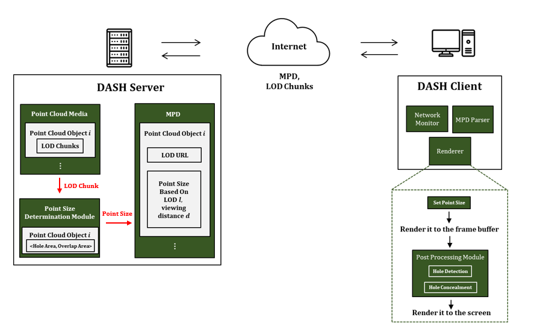
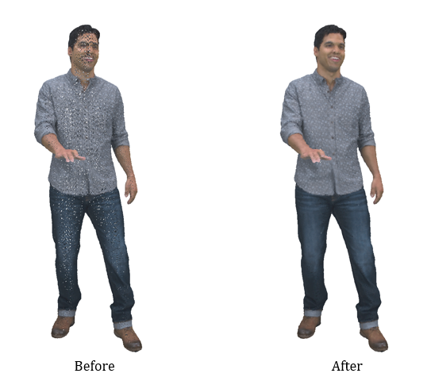

<a id="readme-top"></a>


<!-- ABOUT THE PROJECT -->
## About The Project
Volumetric Video, also known as the next generation media, allows users to experience 6-Degrees of Freedom (DoF), thereby providing a true immersive experience compared to the traditional 2D videos. The downside of these videos is the large data size which is highly unlikely to be supported by the current network infrastructure. In order to overcome this, we propose this system to enhance the user's Quality of Experience (QoE) under the given network. 
### Key Ideas
Here are key ideas of this project: 
* Subdivides the single point cloud frame into numerous Level of Details (LoDs) such that it can be streamed under constrained network.
* Provides optimal point size for each LoD considering the trade-off between the holes and the overlap areas. The calculation is done in the offline phase and provided in the metafile to the client.
* Adopts 2D interpolation technique at the client side to decect occuring holes and conceal them to enhance the final visual quality.

### System Architecture


### Results


### Built With
* ![Node.js]
* ![Three.js]
* ![WebGL]

<!-- GETTING STARTED -->
## Getting Started

Here are some steps to get ready and run the proposed streaming system. 

### Prerequisites

You need the following installed on your machine: 
* **Node.js**
* **npn** (comes with Node.js)

### Installation

1. Clone or download this repository to your local machine. 
2. Open a Node.js terminal in the root folder of the project and install the required dependencies:
   ```bash
   npm install

### Running the Project

1. To start the streaming system: 
    ```bash
    npm run dev
2. Open your web browser to see the system running .

## Contact

Hasung Cho - lifeofcho23@gmail.com
<p align="right">(<a href="#readme-top">back to top</a>)</p>

<!-- MARKDOWN LINKS & IMAGES -->
<!-- https://www.markdownguide.org/basic-syntax/#reference-style-links -->

[Node.js]:https://img.shields.io/badge/node.js-000000?style=for-the-badge&logo=nodedotjs 
[Three.js]: https://img.shields.io/badge/Three.js-black?style=for-the-badge&logo=threedotjs
[WebGL]: https://img.shields.io/badge/WebGL-black?style=for-the-badge&logo=webgl
[exampleImage]: src/images/example.png
[architectureImage]: src/images/architecture.png

