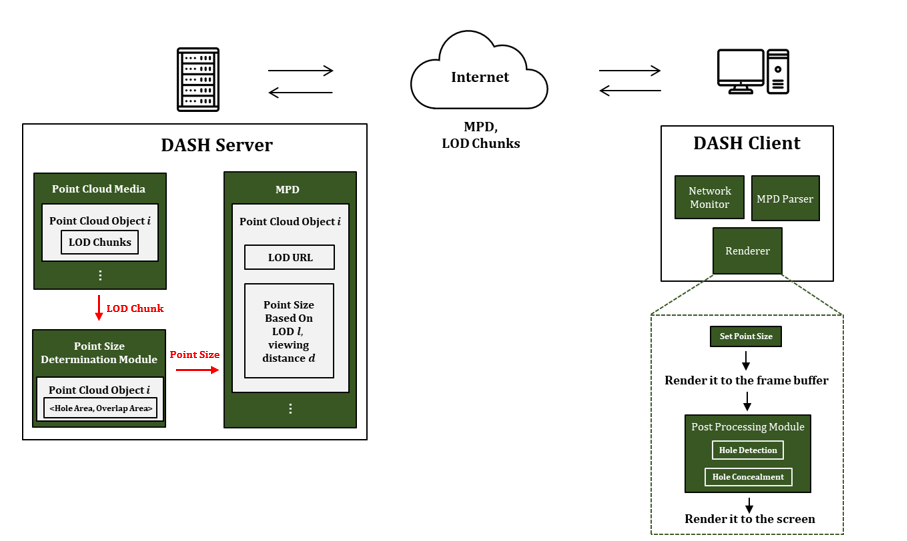
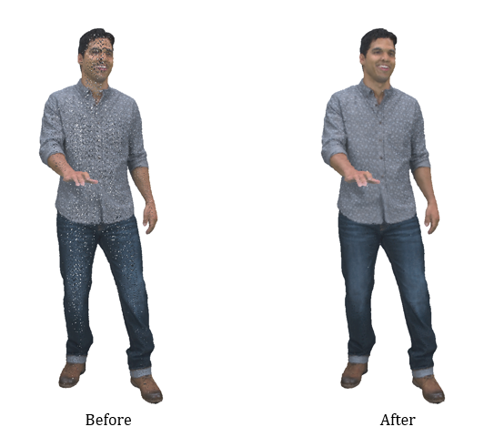

<a id="readme-top"></a>


<!-- ABOUT THE PROJECT -->
## About The Project
Volumetric Video, also known as the next generation media, allows users to experience 6-Degrees of Freedom (DoF), thereby providing a true immersive experience compared to the traditional 2D videos. The downside of these videos is the large data size which is highly unlikely to be supported by the current network infrastructure. In order to overcome this, we propose this system to enhance the user's Quality of Experience (QoE) under the given network. 
### Key Ideas
Here are key ideas of this project: 
* Subdivides the single point cloud frame into numerous Level of Details (LoDs) such that it can be streamed under constrained network.
* Provides optimal point size for each LoD considering the trade-off between the holes and the overlap areas. The calculation is done in the offline phase and provided in the metafile to the client.
* Adopts 2D interpolation technique at the client side to detect occuring holes and conceal them to enhance the final visual quality.

### Repository Structure
* **`src/`**: Real-time adaptive volumetric video streaming web client powered by MPEG-DASH, Three.js, and custom WebGL shaders (`stream.js`).
* **`offline_research/`**:
  * `create_LoD/`: C++ PCL Octree-based voxelization and LoD generation pipeline with Linux Traffic Control (`tc`) network fluctuation testbeds.
  * `offline_experiments/`: Hole vs. Overlap trade-off measurement and optimal point size determination scripts.
  * `optimization_datasets/`: Precomputed optimal point size metadata (`optimal.txt`) across varying bandwidth alpha factors.
  * `testing_and_legacy/`: Static models, bulk loaders, and legacy test scripts.

### System Architecture


### Results


### Built With
* ![Node.js]
* ![Three.js]
* ![WebGL]

<!-- GETTING STARTED -->
## Getting Started

Here are some steps to get ready and run the proposed streaming system. 

### Prerequisites

You need the following installed on your machine: 
* **Node.js**
* **npm** (comes with Node.js)

### Installation

1. Clone or download this repository to your local machine. 
2. Open a Node.js terminal in the root folder of the project and install the required dependencies:
   ```bash
   npm install
   ```

### Dataset Configuration & Preprocessing Pipeline
Due to the large storage footprint of volumetric video sequences (multi-gigabytes per sequence across multiple LoDs), point cloud datasets are preprocessed and served via an external HTTP media server.

#### 1. Expected Dataset Hierarchy
The streaming client expects Draco-compressed point cloud frames (`.drc`) structured according to `src/metafile.mpd`:
```text
<dataset_root>/
└── longdress/                       # period.id specified in metafile.mpd
    └── sequence/
        ├── frame0000/
        │   ├── LOD0.drc             # Base quality (lowest bandwidth, larger point size)
        │   ├── LOD1.drc
        │   └── ...
        │   └── LOD14.drc            # Highest quality (highest bandwidth, fine point size)
        ├── frame0001/
        │   ├── LOD0.drc
        │   └── ...
        └── ...
```

#### 2. Generating LoD Datasets (`offline_research/create_LoD/`)
If you have raw point cloud sequences (e.g., 8i / Microsoft Voxelized Upper Bodies sequences in `.ply` format), you can generate the required LoD hierarchy and Draco files using the provided pipeline:

* **Step A: Octree-based LoD Division (`divide/`)**
  Uses C++ Point Cloud Library (PCL) Octree voxel search (`pcl::octree::OctreePointCloudSearch`) to divide each raw frame into hierarchical LoD layers:
  ```bash
  cd offline_research/create_LoD/divide
  mkdir -p build && cd build
  cmake ..
  make
  cd ..
  # Usage: ./divide.sh <input_ply_directory> <output_directory>
  ./divide.sh /path/to/raw_ply_frames /path/to/output_lod_ply
  ```

* **Step B: Draco Point Cloud Compression (`changeFormat/`)**
  Encodes the subdivided `.ply` files into compressed `.drc` files using Google Draco:
  ```bash
  cd ../changeFormat
  # Update DRACO_ENCODER_PATH in ply2dracov2.sh if needed
  ./ply2dracov2.sh /path/to/output_lod_ply /path/to/dataset/longdress/sequence
  ```

#### 3. Serving Datasets Locally
Run an HTTP server with CORS enabled inside your dataset root directory:
```bash
# Inside <dataset_root>
python -m http.server 8080 --cors
```

#### 4. Configure Endpoint
Ensure `src/stream.js` points to your HTTP media server:
```javascript
// src/stream.js (Line 324)
const baseUrl = 'http://localhost:8080/dataset/' + period.id + '/';
```

### Running the Project

1. To start the streaming system: 
    ```bash
    npm run dev
    ```
2. Open your web browser to see the system running.

## Contact

Hasung Cho - lifeofcho23@gmail.com
<p align="right">(<a href="#readme-top">back to top</a>)</p>

<!-- MARKDOWN LINKS & IMAGES -->
<!-- https://www.markdownguide.org/basic-syntax/#reference-style-links -->

[Node.js]:https://img.shields.io/badge/node.js-000000?style=for-the-badge&logo=nodedotjs 
[Three.js]: https://img.shields.io/badge/Three.js-black?style=for-the-badge&logo=threedotjs
[WebGL]: https://img.shields.io/badge/WebGL-black?style=for-the-badge&logo=webgl
[exampleImage]: src/images/example.png
[architectureImage]: src/images/architecture.png

